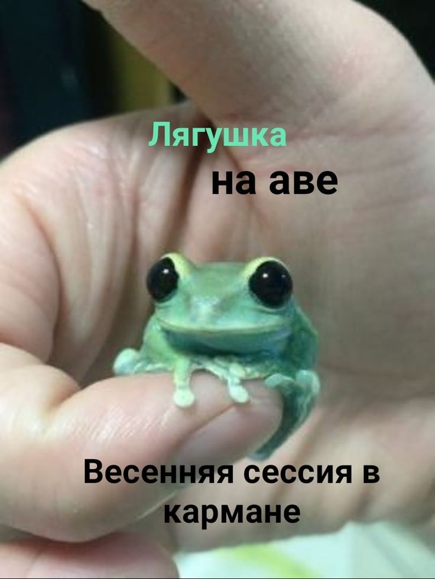

| Имя              | Роль в проекте                                   | Github                          |
|------------------|--------------------------------------------------|---------------------------------|
| Мезенин Олег     | Разработка парсера символов, архитектура проекта | https://github.com/KlukaCross   |
| Меркулов Фёдор   | Разработка интепретатора, синтаксис языка        | https://github.com/WhatTheMUCK  |
| Самсонов Савелий | Разработка парсера токенов, тестирование         | https://github.com/FlyingOwl8   |
| Синюков Антон    | Размещение документации на Github Pages          | https://github.com/AntonCkya    |
| Чапкин Владислав | Разработка расширения для VS Code                | https://github.com/MLGBrotishka |
| YaGPT            | Помощь в написании отчёта                        |                                 |

[На главную]({{site.baseurl}})