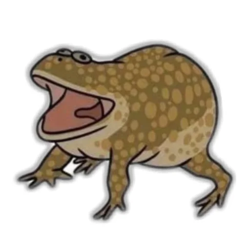

## Jaba's Swamp 


Расширение добавляет поддержку языка Jaba в Vscode.

В расширение входят:

- Подсветка синтаксиса: ключевые слова языка, комментарии и скобочные последовательности подсвечиваются в соответствии с правилами языка.


- Тема для языка: рекомендованная тема, настраивает подсветку синтаксиса и интерфейс ide для полного погружения в разработку языка  так, как это было задумано создателями языка


- Расширение функциональности: добавлена возможность удобного запуска программ написанных на Jaba, нажатием одной кнопки.


### Установка

Для установки достаточно скачать [файл](https://github.com/MAILabs-Edu-2024/fp-compiler-lab-todo/blob/main/extension/jabas-swamp-0.0.1.vsix) с расширением .vsix и запустить команду

```bash
code --install-extension jabas-swamp-0.0.1.vsix
```



[На главную]({{site.baseurl}})
